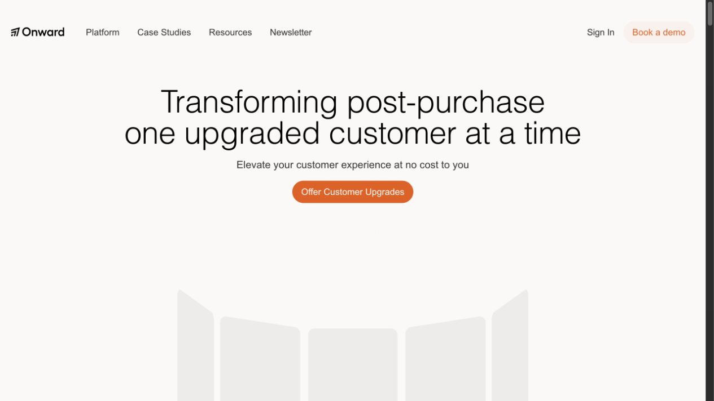
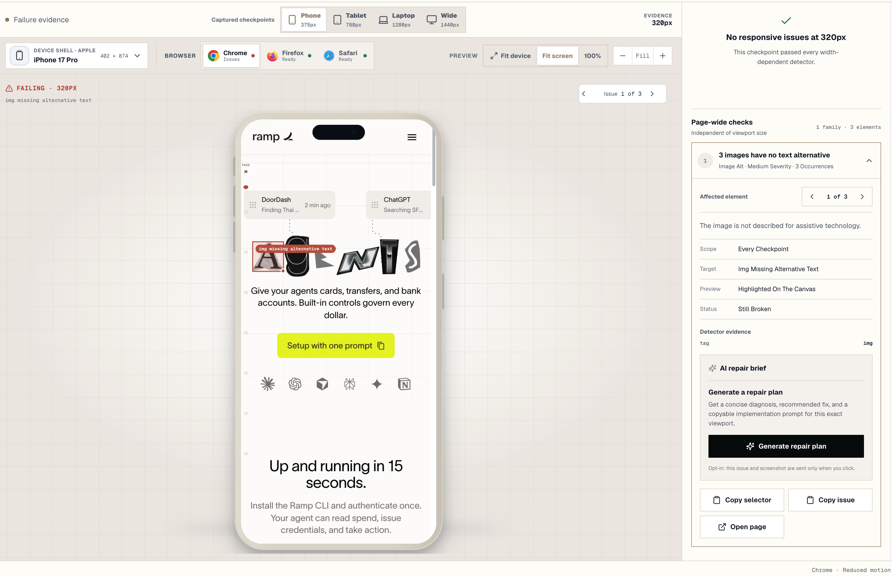

# Breakscope

Breakscope is a local responsive-testing lab. Paste a localhost or public HTTPS URL, discover its routes, and inspect responsive failures across breakpoint and browser captures.

## See it in action

Breakscope can inspect a public site such as [Onward](https://useonward.com) across responsive checkpoints.



Select a finding to focus its affected element, inspect deterministic evidence, and generate a repair brief without leaving the local workspace.



## Workspace

- `apps/web` — Breakscope landing, setup, workspace, and shareable reports
- `apps/local-capture` — localhost-only Playwright capture companion
- `packages/shared` — responsive-test contracts
- `packages/validation` — target URL validation
- `packages/comparison-engine` — responsive detectors

## Local development

```bash
pnpm install
pnpm dev:local
```

Open `http://localhost:3000`. `dev:local` starts both the Next.js interface and the capture companion.

## Product routes

- `/` — paste a target URL
- `/setup` — choose routes and responsive checkpoints
- `/workspace` — scan and inspect findings
- `/report/:token` — shared report

## Commands

```bash
pnpm typecheck
pnpm lint
pnpm test
pnpm test:e2e
pnpm build
pnpm preview
```

Use a localhost target or a public HTTPS preview URL. Browser captures stay on the local machine.
