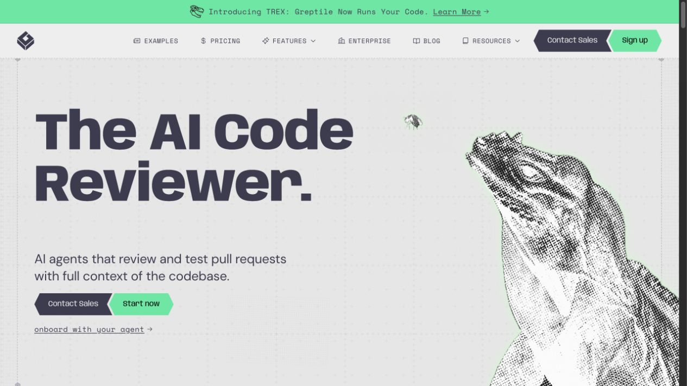
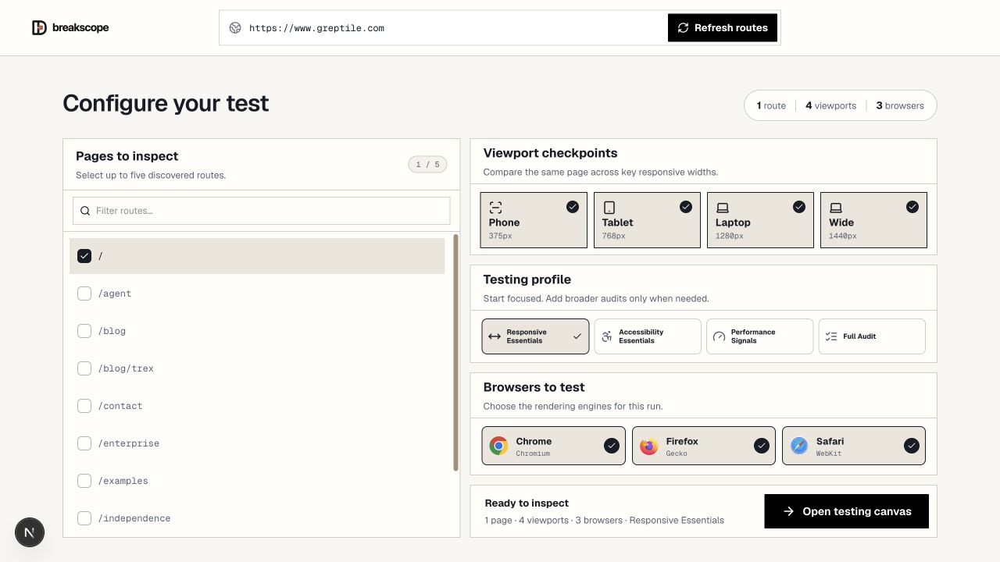
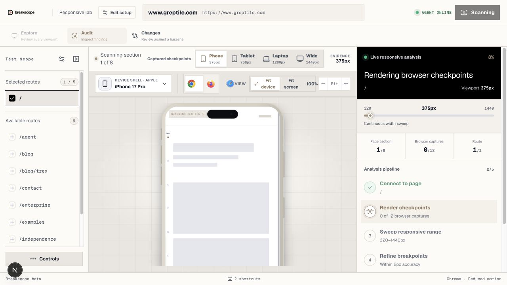
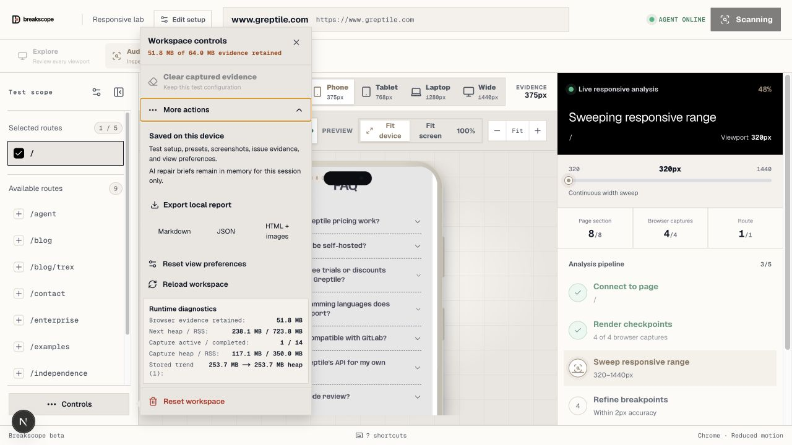

# Breakscope

Breakscope is a local responsive-testing workbench for finding the exact widths where a web interface breaks. It discovers routes, captures real browser renders, sweeps the responsive range between familiar device sizes, groups related failures, and keeps the evidence in one review workspace.

> **Beta: local-only.** This version has no accounts, teams, scheduled cloud scans, or hosted project storage. Test configuration, scan history, screenshots, baselines, and view preferences are stored on the device running Breakscope. See [Local data and privacy](#local-data-and-privacy) for the one optional exception.

## Portfolio walkthrough: Greptile

The screenshots below use [Greptile](https://www.greptile.com) as a real public target. Greptile is not affiliated with Breakscope; it is used only to demonstrate the beta workflow against a production website.

### 1. Choose a real target

Breakscope accepts a localhost URL or a public HTTPS URL. It discovers same-origin HTML routes before the test is configured.



### 2. Configure the test

Select up to five discovered routes, four common viewport checkpoints, one or more rendering engines, and the audit depth. The screenshot shows the complete cross-browser configuration; a focused Chrome run was used for the remaining showcase captures.



### 3. Watch the local capture pipeline

The workspace reports its current route, width, page section, browser-capture count, and analysis stage while the local Playwright companion renders the page.



### 4. Keep control of local evidence

Workspace controls show how much screenshot evidence is retained, allow local report export, and provide targeted cleanup without requiring a hosted account.



## Beta feature list

### Target and test setup

- Accepts `localhost`, loopback, and public HTTPS targets.
- Discovers same-origin HTML routes automatically.
- Lets you select up to five routes per test.
- Includes four quick checkpoints: phone `375px`, tablet `768px`, laptop `1280px`, and wide desktop `1440px`.
- Supports Chromium, Firefox, and WebKit capture engines when their Playwright runtimes are installed.
- Provides four profiles:
  - **Responsive Essentials** — layout failures only.
  - **Accessibility Essentials** — responsive and accessibility checks.
  - **Performance Signals** — responsive and performance checks.
  - **Full Audit** — all available checks.

### Responsive capture and analysis

- Captures real browser screenshots instead of embedding cross-origin pages in iframes.
- Sweeps continuously between `320px` and `1440px`, not only at the four named checkpoints.
- Refines detected failure boundaries to within `2px`.
- Freezes or reduces motion during deterministic capture.
- Tracks scan progress by route, page section, browser, width, and analysis stage.
- Preserves completed progress when a test is cancelled.
- Can retry a failed browser/viewport capture without discarding the rest of the run.

### Explore mode

- Shows all captured viewports together in one overview.
- Lets every viewport scroll independently by default.
- Can synchronize proportional scrolling across viewport captures.
- Focuses any overview pane into the detailed device evidence view.
- Counts responsive blocker families instead of inflating totals for every affected element.

### Audit mode

- Detects responsive overflow, offscreen content, clipping, overlaps, occlusion, and disappearing elements.
- Separates findings into **Responsive**, **Accessibility**, **Usability**, and **Performance** categories.
- Groups repeated occurrences into one finding family.
- Shows failing and last-known-passing evidence where available.
- Highlights the affected element on the captured page.
- Records the DOM selector, stable target, element box, route, browser, viewport, and source hint when available.
- Supports previous/next finding navigation and a one-at-a-time priority review queue.
- Supports targeted retesting of the selected route, width, and browser.
- Copies a selector, a Markdown issue summary, or an implementation prompt to the clipboard.

### Device and evidence inspection

- Includes phone, tablet, laptop, and desktop device shells.
- Provides portrait and landscape orientation for mobile devices.
- Supports recent and pinned devices in the device picker.
- Switches between captured browser engines without leaving the workspace.
- Offers **Fit device**, **Fit screen**, **100%**, and manual zoom controls.
- Keeps checkpoint, browser, route, scale, and selected-finding context together.

### Changes and local baselines

- Stores completed scans in local history.
- Lets you mark one trusted local scan as the baseline.
- Compares a later matching checkpoint against that baseline.
- Produces baseline, current, and pixel-difference views with a changed-pixel percentage.
- Classifies audit findings as new, regressed, existing, or fixed when baseline evidence is available.
- Lets you reopen or delete an individual local scan.

### Reports, storage, and workspace controls

- Exports reports as Markdown, JSON, or self-contained HTML with embedded evidence images.
- Shows retained evidence usage against the local `64 MB` budget.
- Clears captured evidence while keeping the test configuration.
- Resets view preferences independently.
- Reloads or fully resets the workspace from the controls panel.
- Shows local runtime and capture-process diagnostics in development.

### Accessibility and keyboard workflow

- Uses visible keyboard focus and semantic labels throughout the core workflow.
- Respects reduced-motion preferences.
- Supports keyboard shortcuts:

| Action | Shortcut |
| --- | --- |
| Previous / next checkpoint | `[` / `]` |
| Next browser | `B` |
| Previous / next finding | `Option + ←` / `Option + →` |
| Clear selected finding | `Esc` |
| Run test | `Command + Return` |

### Optional AI repair brief

When `NVIDIA_API_KEY` is configured, a selected finding can request an AI-assisted diagnosis, recommendation, and implementation prompt. This feature is optional and is the only current workflow that may send finding context to an external service. Without the key, all capture, deterministic analysis, evidence review, history, baselines, and exports continue to work locally.

## How to run Breakscope

### Requirements

- Node.js 20 or newer.
- pnpm 10.
- At least one supported Playwright browser runtime.

### Install

```bash
pnpm install
pnpm --filter @breakscope/local-capture exec playwright install chromium firefox webkit
```

Install only the engines you intend to use if you do not need all three:

```bash
pnpm --filter @breakscope/local-capture exec playwright install chromium
```

### Start the local beta

```bash
pnpm dev:local
```

Open [http://localhost:3000](http://localhost:3000). The command starts:

- the Next.js interface on port `3000`;
- the local Playwright capture companion on `127.0.0.1:4317`.

### Run a test

1. Paste a localhost or public HTTPS URL on the home page.
2. Wait for Breakscope to discover same-origin routes.
3. Select routes, viewport checkpoints, browser engines, and a testing profile.
4. Choose **Open testing canvas**. The first scan starts automatically.
5. Use **Explore** to compare all completed checkpoint captures.
6. Use **Audit** to inspect finding families and their evidence.
7. Open **Changes** after a completed run to select a baseline or compare a later scan.
8. Open **Controls → More actions** to export or manage local evidence.

Long production pages can take several minutes because Breakscope scrolls through page sections, captures multiple browser/width combinations, and refines responsive boundaries. Start with one route, one browser, and **Responsive Essentials**, then expand the scope when needed.

## Local data and privacy

The beta saves the following on the current device:

- target and route selection;
- browser, viewport, device, scale, and orientation preferences;
- scan history and selected baseline;
- checkpoint screenshots and finding evidence;
- deterministic findings and local diagnostics.

There is no account synchronization or hosted project workspace in this version. Clearing browser site data or using **Reset workspace** removes local state. AI repair briefs are held in memory for the current session and require the optional external API configuration described above.

## Current beta boundaries

- No accounts, organizations, team comments, or cloud project sync.
- No scheduled scans, notifications, or pull-request status checks.
- No hosted real-device farm; browser engines run through local Playwright.
- No general-purpose interaction recording for authenticated menus, dialogs, or form states yet.
- Cross-origin pages are represented by real captures, not interactive embedded iframes.
- Very long or animation-heavy production pages can make continuous sweeps and breakpoint refinement slow; narrow the route/browser scope for the first pass.
- Local authenticated capture, console/network diagnostics, accessibility display modes, and reusable interaction recipes are planned rather than complete.

## Repository map

| Path | Responsibility |
| --- | --- |
| `apps/web` | Landing, setup, Explore/Audit workspace, history, reports, and local persistence UI |
| `apps/local-capture` | Local Playwright route discovery, browser rendering, screenshots, DOM snapshots, and Axe checks |
| `packages/comparison-engine` | Responsive analysis and pixel comparison |
| `packages/shared` | Shared scan, capture, evidence, and finding contracts |
| `packages/validation` | Target URL validation |
| `packages/database` | Database package reserved for the broader product architecture |

## Product routes

| Route | Purpose |
| --- | --- |
| `/` | Enter a target and discover routes |
| `/about` | Product motivation and local-beta scope |
| `/setup` | Select routes, viewports, browsers, and profile |
| `/workspace` | Run scans, explore captures, and audit findings |
| `/history` | Manage local runs, baselines, and visual comparisons |
| `/report/:token` | Render an existing report token when report data is available |

## Development commands

```bash
pnpm typecheck
pnpm lint
pnpm test
pnpm test:e2e
pnpm build
pnpm preview
```

## Status

Breakscope is an actively developed local beta. The current focus is capture stability, authenticated local capture, page diagnostics, safe interaction recipes, and additional accessibility display modes. A hosted version with accounts and persistent projects is planned separately; the local beta remains the working product described in this README.
