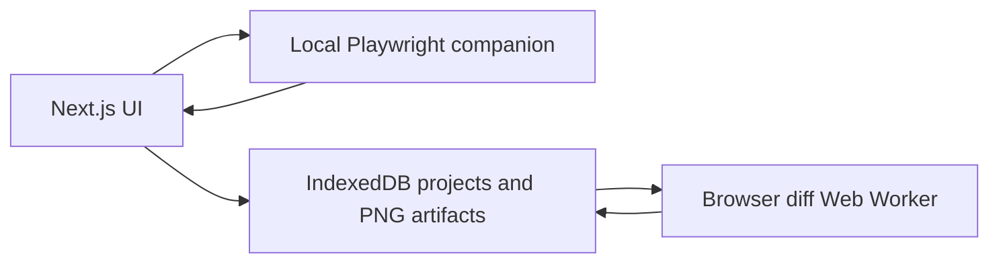
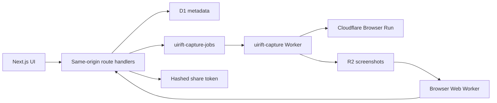

# UIRift architecture

## Current local runtime



The guest workflow creates projects and runs in IndexedDB. A localhost-only Node process captures approved preview URLs with Playwright, then returns the PNGs directly to the browser. The Web Worker calculates the diff and grouped regions; the browser stores the result and decisions locally. No application data leaves the machine.

## Future hosted runtime

UIRift uses one public Next.js Worker and one private Queue consumer:



This Cloudflare adapter is retained for the later authenticated release. It is not required or invoked by the current guest workflow.

## Workspace packages

- `apps/web`: Next.js App Router UI, local IndexedDB repository, future Better Auth APIs, and client diff worker.
- `apps/local-capture`: localhost-only Playwright capture service.
- `workers/capture`: Browser Run Queue consumer and scheduled retention cleanup.
- `packages/database`: Drizzle schema for product data.
- `packages/validation`: approved-host URL and request validation.
- `packages/comparison-engine`: pixel comparison and changed-region grouping.
- `packages/shared`: versioned Queue message, viewports, and seeded demo fixtures.

## Data and artifacts

D1 stores users, sessions, projects, runs, regions, token hashes, and daily usage. R2 objects use:

```text
users/{userId}/projects/{projectId}/runs/{runId}/{baseline|candidate|diff}.png
```

Artifacts and share links expire after seven days. The scheduled capture Worker deletes expired R2 objects and their D1 run, region, and share records. Deleting a project also removes its R2 objects before deleting metadata.

## Guardrails

- Two projects per user.
- Three live attempts per user per UTC day.
- One active comparison per user.
- Ten retained runs per project.
- One viewport per run.
- Global browser cutoff at eight minutes of recorded daily use, leaving headroom under the configured free allowance.
- Queue retries recoverable failures twice.
- The seeded `/demo` remains available when live capture is paused.

## Security boundary

The first release accepts only HTTPS origins on explicitly approved preview hosts. URL validation rejects credentials, IP literals, localhost, private networks, non-root origins, and unsupported hosts. The capture worker is private and can be reached only through the Queue. User APIs check the Better Auth session and resource ownership. Public artifacts require a SHA-256 token match, an unexpired share, and a non-revoked record.

This MVP does not support authenticated target websites, arbitrary public domains, private repositories, or PR installations.
